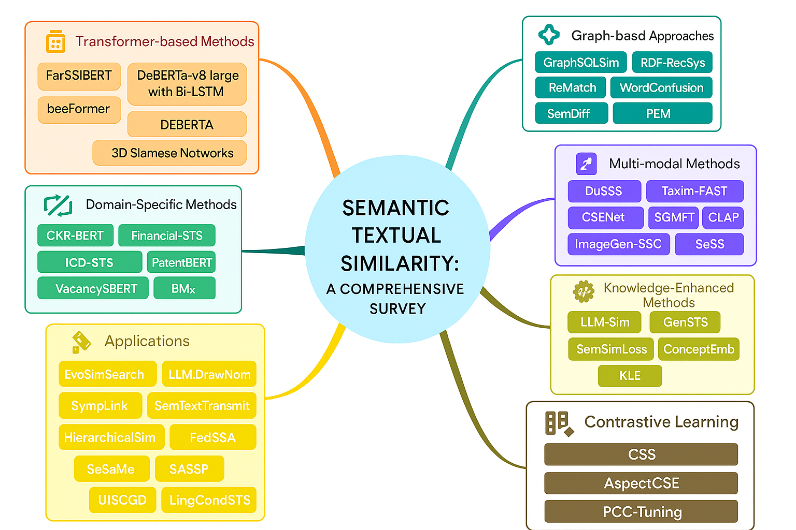

# Advances and Challenges in Semantic Textual Similarity: A Comprehensive Survey

[](https://arxiv.org/abs/2601.03270)
[](#)
[](#)

This repository is a professional companion page for the survey paper **"Advances and Challenges in Semantic Textual Similarity: A Comprehensive Survey"** by **Lokendra Kumar, Neelesh S. Upadhye, and Kannan Piedy**.

The survey consolidates recent progress in **Semantic Textual Similarity (STS)** after 2021, with emphasis on transformer-based models, contrastive learning, domain adaptation, multimodal similarity, graph-based methods, knowledge-enhanced approaches, applications, evaluation benchmarks, open challenges, and future research directions.

> **Paper:** [arXiv:2601.03270](https://arxiv.org/abs/2601.03270)  
> **PDF:** [Advances and Challenges in Semantic Textual Similarity.pdf](./Advances%20and%20Challenges%20in%20Semantic%20Textual%20Similarity.pdf)

---

## Table of Contents

- [Overview](#overview)
- [Taxonomy](#taxonomy)
- [Key Contributions](#key-contributions)
- [Survey Scope](#survey-scope)
- [Dataset and Benchmark Links](#dataset-and-benchmark-links)
- [Evaluation Metrics](#evaluation-metrics)
- [Repository Structure](#repository-structure)
- [Research Gaps Highlighted in the Survey](#research-gaps-highlighted-in-the-survey)
- [Recommended Use](#recommended-use)
- [Citation](#citation)
- [License and Dataset Use](#license-and-dataset-use)

---

## Overview

Semantic Textual Similarity measures how closely two text segments align in meaning rather than only in surface-level word overlap. Modern STS systems are central to semantic search, paraphrase detection, information retrieval, recommendation, clinical and financial NLP, question answering, dialogue systems, multimodal representation learning, and evaluation of large language models.

This survey focuses on methods published from **January 2021 to July 2025** and organizes the literature into a coherent taxonomy of architectures, training strategies, domains, benchmarks, and practical applications.

---

## Taxonomy

The paper organizes post-2021 STS research into major methodological families.



---

## Key Contributions

- Provides a structured survey of recent STS advances after 2021.
- Compares representative transformer, contrastive, domain-specific, multimodal, graph-based, and knowledge-enhanced methods.
- Summarizes major benchmark datasets and evaluation protocols used in STS and related natural language understanding tasks.
- Discusses limitations in current evaluation practices, including metric saturation, low-resource transfer, fairness, calibration, and statistical significance.
- Highlights open problems in explainability, bias, domain knowledge integration, sustainability, and robust cross-modal semantic understanding.

---

## Survey Scope

| Area | Representative Methods / Topics Covered |
|---|---|
| Transformer-based STS | FarSSiBERT, DeBERTa-v3-large variants, beeFormer, RWKV embeddings, 3D Siamese Networks, SBERT-style architectures |
| Contrastive learning | PCC-Tuning, CSS, AspectCSE, SimCSE-style learning, positive/negative pair optimization, uncertainty-aware contrastive similarity |
| Domain-specific STS | Clinical reports, chest X-ray report similarity, financial narratives, patents, ICD-code sets, recruitment/job title normalization, long-context retrieval |
| Multimodal similarity | Vision-language semantic segmentation, image-text matching, RGB-X segmentation, semantic communication, audio-visual separation |
| Graph-based similarity | AMR matching, semantic dependency graphs, RDF graph similarity, SQL grading graphs, binary-code semantic graphs |
| Knowledge-enhanced methods | LLM-enhanced similarity, generative STS, concept embeddings, kernel language entropy, knowledge-aware encoders |
| Applications | Semantic retrieval, federated learning, adversarial robustness, dialogue generation, ASR data selection, image retrieval, education and medical assessment |

---

## Dataset and Benchmark Links

The following index collects benchmark datasets and related resources named in the paper. Some datasets require registration, institutional approval, or compliance with data-use terms. Always consult the original dataset card, paper, and license before downloading or redistributing data.

### General STS, NLI, and Language Understanding Benchmarks

| Dataset / Benchmark | Primary Use | Link |
|---|---|---|
| GLUE | General language understanding benchmark including STS-B, MRPC, QQP, RTE, QNLI, WNLI | [gluebenchmark.com](https://gluebenchmark.com/) |
| STS Benchmark / STS-B | Sentence-pair semantic similarity scoring | [STS Benchmark](http://ixa2.si.ehu.es/stswiki/index.php/STSbenchmark) |
| Microsoft Research Paraphrase Corpus (MRPC) | Paraphrase identification | [Microsoft Download Center](https://www.microsoft.com/en-us/download/details.aspx?id=52398) |
| Quora Question Pairs (QQP) | Duplicate question detection | [Quora Dataset Release](https://quoradata.quora.com/First-Quora-Dataset-Release-Question-Pairs) |
| SICK / SICK-R | Semantic relatedness and textual entailment | [SICK dataset](https://clic.cimec.unitn.it/composes/sick.html) |
| SentEval | Evaluation toolkit for universal sentence encoders | [facebookresearch/SentEval](https://github.com/facebookresearch/SentEval) |
| MTEB | Massive Text Embedding Benchmark for embedding evaluation | [embeddings-benchmark/mteb](https://github.com/embeddings-benchmark/mteb) |
| CARER / Emotion Dataset | Emotion classification and contextual affect representations | [dair-ai/emotion_dataset](https://github.com/dair-ai/emotion_dataset) |
| EVALution | Semantic relation evaluation, including hypernymy and co-hyponymy | [EVALution resource page](http://colinglab.humnet.unipi.it/resources/evaluation/) |
| PIT 2015 | Paraphrase and semantic similarity in Twitter | [cocoxu/SemEval-PIT2015](https://github.com/cocoxu/SemEval-PIT2015) |
| Crisscrossed Captions (CxC) | Intra-modal and inter-modal semantic similarity for images and captions | [google-research-datasets/cxc](https://github.com/google-research-datasets/cxc) |
| MultiFC | Multi-domain fact-checking dataset | [copenlu/multifc](https://github.com/copenlu/multifc) |
| KorNLI / KorSTS | Korean NLI and STS resources | [kakaobrain/KorNLUDatasets](https://github.com/kakaobrain/KorNLUDatasets) |
| ParaNMT-50M | Large-scale paraphrase pairs generated from machine translation | [ParaNMT-50M paper](https://arxiv.org/abs/1711.05732) |
| JGLUE | Japanese general language understanding benchmark | [yahoojapan/JGLUE](https://github.com/yahoojapan/JGLUE) |
| GitHub Issue Similarity (GIS) | Duplicate and non-duplicate issue-pair similarity in software engineering | [GitBugs related open dataset](https://github.com/av9ash/gitbugs/) |
| Interpretable STS | Segment-level interpretable similarity annotations | [iSTS paper](https://arxiv.org/abs/1612.04868) |
| SemEval STS Tasks | Shared tasks for multilingual and cross-lingual STS evaluation | [SemEval STS 2017 paper](https://arxiv.org/abs/1708.00055) |

### Retrieval, Recommendation, and Contrastive-Learning Benchmarks

| Dataset / Benchmark | Area | Link |
|---|---|---|
| BEIR | Heterogeneous information retrieval benchmark | [beir-cellar/beir](https://github.com/beir-cellar/beir) |
| BRIGHT | Reasoning-intensive text retrieval benchmark | [BRIGHT paper](https://arxiv.org/abs/2407.12883) |
| LoCo / Long-context retrieval resources | Long-context retrieval evaluation referenced in retrieval-focused work | [BMX / Baguetter implementation](https://github.com/mixedbread-ai/baguetter) |
| Goodbooks-10k / GB10K | Recommendation benchmark | [zygmuntz/goodbooks-10k](https://github.com/zygmuntz/goodbooks-10k) |
| MovieLens 20M | Recommendation benchmark | [GroupLens MovieLens 20M](https://grouplens.org/datasets/movielens/20m/) |
| Amazon Reviews / Amazon Books | Product review and recommendation data | [Amazon Reviews 2023](https://amazon-reviews-2023.github.io/) |
| SNLI | Natural language inference | [Stanford SNLI](https://nlp.stanford.edu/projects/snli/) |
| MultiNLI / MNLI | Multi-genre natural language inference | [MultiNLI](https://cims.nyu.edu/~sbowman/multinli/) |
| TriviaQA | Reading comprehension and question answering | [TriviaQA](http://nlp.cs.washington.edu/triviaqa/) |
| CoQA | Conversational question answering | [CoQA](https://stanfordnlp.github.io/coqa/) |
| Natural Questions (NQ) | Open-domain question answering | [Natural Questions](https://ai.google.com/research/NaturalQuestions) |
| Banking77 | Banking-domain intent classification | [PolyAI Banking77](https://github.com/PolyAI-LDN/task-specific-datasets/tree/master/banking_data) |
| Papers with Code | Task, method, and dataset metadata used in aspect-based retrieval | [paperswithcode.com](https://paperswithcode.com/) |
| Wikidata | Structured knowledge base used in knowledge and aspect retrieval | [wikidata.org](https://www.wikidata.org/) |
| Wikipedia | General-purpose encyclopedic corpus | [wikipedia.org](https://www.wikipedia.org/) |

### Domain-Specific, Clinical, and Specialized Benchmarks

| Dataset / Benchmark | Area | Link |
|---|---|---|
| CheXpert | Chest X-ray image labels and radiology benchmark | [Stanford CheXpert](https://stanfordmlgroup.github.io/competitions/chexpert/) |
| NegBio | Biomedical/radiology negation and uncertainty extraction | [ncbi-nlp/NegBio](https://github.com/ncbi-nlp/NegBio) |
| MIMIC-CXR | Chest radiographs with reports for clinical NLP and vision-language research | [PhysioNet MIMIC-CXR](https://physionet.org/content/mimic-cxr/) |
| ICD code resources | ICD taxonomy and clinical code set similarity | [WHO ICD](https://www.who.int/standards/classifications/classification-of-diseases) |
| FarSSiM / FarSick | Persian semantic similarity datasets referenced in FarSSiBERT work | [FarSSiBERT paper](https://arxiv.org/abs/2407.19173) |
| Financial phrase / hypernym STS resources | Finance-specific semantic similarity and hypernym ranking | [Financial-STS paper](https://arxiv.org/abs/2303.13475) |
| Patent similarity resources | Patent semantic similarity and patent-document matching | [Patent similarity paper](https://arxiv.org/abs/2401.06782) |
| Recruitment/job-title data | VacancySBERT and job title normalization benchmarks | [VacancySBERT paper](https://arxiv.org/abs/2307.16638) |

### Multimodal, Vision, Audio, and Semantic Communication Benchmarks

| Dataset / Benchmark | Area | Link |
|---|---|---|
| QaTa-COV19 | COVID-19 medical image segmentation | [QaTa-COV19 challenge](https://www.kaggle.com/datasets/aysendegerli/qatacov19-dataset) |
| MoNuSeg | Multi-organ nuclei segmentation | [MoNuSeg challenge](https://monuseg.grand-challenge.org/) |
| Cityscapes | Urban scene semantic segmentation | [cityscapes-dataset.com](https://www.cityscapes-dataset.com/) |
| MFNet | RGB-thermal semantic segmentation | [MFNet dataset](https://www.mi.t.u-tokyo.ac.jp/static/projects/mil_multispectral/) |
| ZJU RGB-D/RGB-P resources | RGB-X segmentation resource referenced in CSFNet experiments | [CSFNet paper](https://arxiv.org/abs/2407.01328) |
| MSR Paraphrase / MSRPC | Text-pair matching benchmark used in text-image similarity settings | [MRPC download](https://www.microsoft.com/en-us/download/details.aspx?id=52398) |
| CNN/DailyMail | News summarization dataset | [CNN/DailyMail on Hugging Face](https://huggingface.co/datasets/abisee/cnn_dailymail) |
| XSum | Extreme summarization dataset | [Edinburgh NLP XSum](https://github.com/EdinburghNLP/XSum) |
| Weibo multimodal datasets | Social media multimodal classification and location prediction | [Weibo dataset search](https://paperswithcode.com/dataset/weibo) |
| MUSIC | Audio-visual source separation | [MUSIC dataset page](https://github.com/roudimit/MUSIC_dataset) |
| VGGSound | Audio-visual event dataset | [VGGSound](https://www.robots.ox.ac.uk/~vgg/data/vggsound/) |
| AudioCaps | Audio captioning and audio-language benchmark | [AudioCaps](https://audiocaps.github.io/) |

### Graph, AMR, RDF, and Program-Semantics Resources

| Resource | Area | Link |
|---|---|---|
| AMR datasets | Abstract Meaning Representation parsing and graph matching | [AMR guidelines and data information](https://amr.isi.edu/) |
| RARE benchmark | AMR robustness / graph matching benchmark referenced by ReMatch | [ReMatch paper](https://arxiv.org/abs/2404.02126) |
| RDF graph resources | RDF graph similarity and recommender-system evaluation | [RDF 1.1 Concepts](https://www.w3.org/TR/rdf11-concepts/) |
| SQL grading datasets | Semantic query similarity and SQL grading | [GraphSQLSim paper](https://arxiv.org/abs/2403.14441) |
| Binary-code similarity datasets | Program semantic similarity and binary analysis | [PEM paper](https://dl.acm.org/doi/10.1145/3611643.3616346) |

---

## Evaluation Metrics

The survey discusses the importance and limitations of multiple evaluation criteria:

| Metric Type | Examples | Typical Use |
|---|---|---|
| Correlation metrics | Pearson, Spearman | STS score agreement with human similarity ratings |
| Error metrics | MSE, MAE | Regression-style similarity scoring |
| Ranking metrics | MRR, Recall@K, NDCG@K, MAP | Retrieval, recommendation, and aspect-based similarity |
| Classification metrics | Accuracy, F1, AUC | Paraphrase, entailment, intent, and binary similarity tasks |
| Calibration / uncertainty metrics | AUROC, AUARC | Confidence-aware and uncertainty-aware semantic similarity |
| Vision and multimodal metrics | Dice, mIoU, SDR, PSNR, SSIM, LPIPS | Segmentation, visual similarity, semantic communication, audio-visual separation |

The paper cautions that correlation-only evaluation can hide ceiling effects, calibration errors, subgroup disparities, and retrieval-ranking weaknesses.

---

## Repository Structure

A recommended project layout is shown below.

```text
Semantic-Similarity-Survey/
├── README.md
├── Advances and Challenges in Semantic Textual Similarity.pdf
├── 1.png
├── assets/
│   └── taxonomy.png
├── datasets/
│   └── dataset_links.md
├── notes/
│   ├── transformer_methods.md
│   ├── contrastive_learning.md
│   ├── domain_specific_sts.md
│   ├── multimodal_sts.md
│   ├── graph_based_sts.md
│   └── knowledge_enhanced_sts.md
└── citation.bib
```

---

## Research Gaps Highlighted in the Survey

The survey identifies several open problems for future STS research:

1. **Explainability and interpretability**: Many high-performing neural STS models remain difficult to explain, especially in clinical, legal, financial, and educational settings.
2. **Fairness and bias**: STS systems can underperform for minority languages, dialects, informal text, code-switched text, and underrepresented demographic groups.
3. **Domain knowledge integration**: Specialized domains often require ontologies, taxonomies, knowledge graphs, or domain-specific supervision beyond generic embeddings.
4. **Cross-modal similarity**: Multimodal STS needs stronger alignment across text, images, video, audio, structured data, and domain-specific signals.
5. **Evaluation robustness**: Small metric gains should be supported by statistical testing, calibration analysis, and subgroup-specific reporting.
6. **Efficiency and sustainability**: Larger models improve performance but raise cost, latency, reproducibility, and environmental concerns.

---

## Recommended Use

This repository can be used as:

- A reading guide for researchers entering STS, sentence embeddings, and semantic similarity evaluation.
- A benchmark index for comparing STS models across general, domain-specific, graph-based, and multimodal settings.
- A starting point for literature reviews on post-2021 semantic similarity research.
- A companion reference for implementing or evaluating STS methods in applied NLP projects.

---

## Citation

If this survey is useful for your research, please cite the paper:

```bibtex
@misc{kumar2025advanceschallengessemantictextual,
      title={Advances and Challenges in Semantic Textual Similarity: A Comprehensive Survey},
      author={Lokendra Kumar and Neelesh S. Upadhye and Kannan Piedy},
      year={2025},
      eprint={2601.03270},
      archivePrefix={arXiv},
      primaryClass={cs.CL},
      url={https://arxiv.org/abs/2601.03270},
}
```

---

## License and Dataset Use

No repository license was specified in the attached files. Before public release, add an appropriate license file, such as `LICENSE`, and verify that all referenced datasets are used according to their original licenses, terms of service, and citation requirements.

For clinical, biomedical, social media, and proprietary-domain datasets, additional access controls or ethical review may apply.
